# 对Git中Flutter项目的分析 仿Boss直聘
项目地址: https://github.com/ZukGit/Flutter_P1

**效果 以及代码结构**
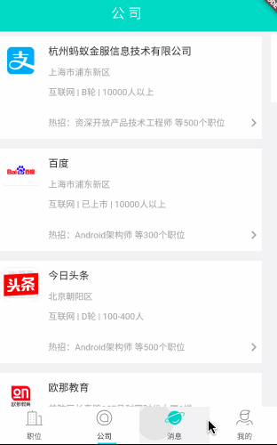   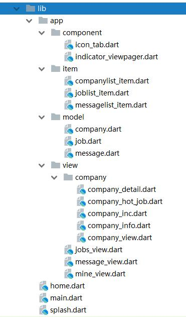  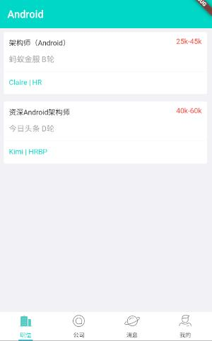  


# 代码总集

## main.dart   (程序入口)
```
main.dart
import 'package:flutter/material.dart';
import 'package:flutter_app/splash.dart';

void main() {
  runApp(new MaterialApp(
    title: "Boss直聘",
    theme: new ThemeData(
      primaryIconTheme: const IconThemeData(color: Colors.white),
      brightness: Brightness.light,
      primaryColor: new Color.fromARGB(255, 0, 215, 198),
      accentColor: Colors.cyan[300],
    ),
    home: new SplashPage()));
}
```


## splash.dart (启动画面页)
```
splash.dart
import 'dart:async';

import 'package:flutter/material.dart';
import 'package:flutter_app/home.dart';

class SplashPage extends StatefulWidget {
  @override
  SplashState createState() => new SplashState();
}

class SplashState extends State<SplashPage> {

  Timer _t;

  @override
  void initState() {
    super.initState();
    _t = new Timer(const Duration(milliseconds: 1500), () {
      try {
        Navigator.of(context).pushAndRemoveUntil(new MaterialPageRoute(
            builder: (BuildContext context) => new BossApp()), (
            Route route) => route == null);
      } catch (e) {

      }
    });
  }

  @override
  void dispose() {
    _t.cancel();
    super.dispose();
  }

  @override
  Widget build(BuildContext context) {
    return new Material(
      color: new Color.fromARGB(255, 0, 215, 198),
      child: new Padding(
        padding: const EdgeInsets.only(
          top: 150.0,
        ),
        child: new Column(
          children: <Widget>[
            new Text("BOSS直聘",
              style: new TextStyle(color: Colors.white,
                  fontSize: 50.0,
                  fontWeight: FontWeight.bold),),
          ],
        ),
      ),
    );
  }
}
```


## home.dart (主页面)

```
home.dart
import 'package:flutter/material.dart';
import 'package:flutter_app/app/component/icon_tab.dart';
import 'package:flutter_app/app/view/company/company_view.dart';
import 'package:flutter_app/app/view/jobs_view.dart';
import 'package:flutter_app/app/view/message_view.dart';
import 'package:flutter_app/app/view/mine_view.dart';

const double _kTabTextSize = 11.0;
const int INDEX_JOB = 0;
const int INDEX_COMPANY = 1;
const int INDEX_MESSAGE = 2;
const int INDEX_MINE = 3;
Color _kPrimaryColor = new Color.fromARGB(255, 0, 215, 198);

class BossApp extends StatefulWidget {
  @override
  HomeState createState() => new HomeState();
}

class HomeState extends State<BossApp> with SingleTickerProviderStateMixin {
  int _currentIndex = 0;
  TabController _controller;
  VoidCallback onChanged;

  @override
  void initState() {
    super.initState();
    _controller =
    new TabController(initialIndex: _currentIndex, length: 4, vsync: this);
    onChanged = () {
      setState(() {
        _currentIndex = this._controller.index;
      });
    };

    _controller.addListener(onChanged);
  }

  @override
  void dispose() {
    _controller.removeListener(onChanged);
    _controller.dispose();
    super.dispose();
  }

  @override
  Widget build(BuildContext context) {
    return new Scaffold(
      body: new TabBarView(
        children: <Widget>[
          new JobsTab(), new CompanyTab(), new MessageTab(), new MineTab()],
        controller: _controller,
      ),
      bottomNavigationBar: new Material(
        color: Colors.white,
        child: new TabBar(
          controller: _controller,
          indicatorSize: TabBarIndicatorSize.label,
          labelStyle: new TextStyle(fontSize: _kTabTextSize),
          tabs: <IconTab>[
            new IconTab(
              icon: _currentIndex == INDEX_JOB
                ? "assets/images/ic_main_tab_company_pre.png"
                : "assets/images/ic_main_tab_company_nor.png",
              text: "职位",
              color: _currentIndex == INDEX_JOB ? _kPrimaryColor : Colors.grey[900]
            ),
            new IconTab(
              icon: _currentIndex == INDEX_COMPANY
                ? "assets/images/ic_main_tab_contacts_pre.png"
                : "assets/images/ic_main_tab_contacts_nor.png",
              text: "公司",
              color: _currentIndex == INDEX_COMPANY ? _kPrimaryColor : Colors.grey[900]
            ),
            new IconTab(
              icon: _currentIndex == INDEX_MESSAGE
                ? "assets/images/ic_main_tab_find_pre.png"
                : "assets/images/ic_main_tab_find_nor.png",
              text: "消息",
              color: _currentIndex == INDEX_MESSAGE ? _kPrimaryColor : Colors.grey[900]
            ),
            new IconTab(
              icon: _currentIndex == INDEX_MINE
                ? "assets/images/ic_main_tab_my_pre.png"
                : "assets/images/ic_main_tab_my_nor.png",
              text: "我的",
              color: (_currentIndex == INDEX_MINE) ? _kPrimaryColor : Colors.grey[900]
            ),
          ],
        ),
      ),
    );
  }
}
```

## model/Job.dart 职位 Tab页面的Bean
```
import 'dart:convert';

import 'package:meta/meta.dart';

class Job {
  final String name;
  final String cname;
  final String size;
  final String salary;
  final String username;
  final String title;

  Job({
    @required this.name,
    @required this.cname,
    @required this.size,
    @required this.salary,
    @required this.username,
    @required this.title
  });

  static List<Job> fromJson(String json) {
    return JSON
        .decode(json)['list']
        .map((obj) => Job.fromMap(obj))
        .toList();
  }

  static Job fromMap(Map map) {
    return new Job(
        name: map['name'],
        cname: map['cname'],
        size: map['size'],
        salary: map['salary'],
        username: map['username'],
        title: map['title']
    );
  }
}


```


## model/company.dart 公司 Tab页面的Bean
```
import 'dart:convert';

import 'package:meta/meta.dart';

class Company {
  final String logo; // logo
  final String name; // 公司名称
  final String location; // 公司位置
  final String type; // 公司性质
  final String size; // 公司规模
  final String employee; // 公司人数
  final String hot; // 热招职位
  final String count; // 职位总数
  final String inc;   // 公司详情

  //构造函数
  Company({
    @required this.logo,
    @required this.name,
    @required this.location,
    @required this.type,
    @required this.size,
    @required this.employee,
    @required this.hot,
    @required this.count,
    @required this.inc
  });

  static List<Company> fromJson(String json) {
    return JSON
        .decode(json)['list']
        .map((obj) => Company.fromMap(obj))
        .toList();
  }

  static Company fromMap(Map map) {
    return new Company(
        logo: map['logo'],
        name: map['name'],
        location: map['location'],
        type: map['type'],
        size: map['size'],
        employee: map['employee'],
        hot: map['hot'],
        count: map['count'],
        inc: map['inc']
    );
  }
}
```


## model/message.dart 消息 Tab页面的Bean
```
import 'dart:convert';

import 'package:meta/meta.dart';

class Message {
  final String name;
  final String avatar;
  final String company;
  final String position;
  final String msg;

  Message({
    @required this.name,
    @required this.avatar,
    @required this.company,
    @required this.position,
    @required this.msg,
  });

  static List<Message> fromJson(String json) {
    return JSON
        .decode(json)['list']
        .map((obj) => Message.fromMap(obj))
        .toList();
  }

  static Message fromMap(Map map) {
    return new Message(
        name: map['name'],
        avatar: map['avatar'],
        company: map['company'],
        position: map['position'],
        msg: map['msg']
    );
  }
}
```


## component/icon_tab.dart tab图标组件
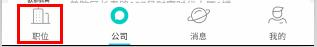 
```
import 'package:flutter/material.dart';

const double _kTextAndIconTabHeight = 53.0; // 导航高度
const double _kMarginBottom = 3.0; // 图标与文字的间隔

class IconTab extends StatefulWidget {

  const IconTab({
    Key key,
    this.text,
    this.icon,
    this.color,
  })
    : assert(text != null || icon != null || color != null),
      super(key: key);

  final String text;
  final String icon;
  final Color color;

  @override
  State<StatefulWidget> createState() {
    return new IconTabState();
  }
}

class IconTabState extends State<IconTab> {

  Widget _buildLabelText() {
    return new Text(widget.text,
      softWrap: false,
      overflow: TextOverflow.fade,
      style: new TextStyle(color: widget.color),
    );
  }

  @override
  Widget build(BuildContext context) {
    assert(debugCheckHasMaterial(context));

    double height = _kTextAndIconTabHeight;
    Widget label = new Column(
      mainAxisAlignment: MainAxisAlignment.center,
      crossAxisAlignment: CrossAxisAlignment.center,
      children: <Widget>[
        new Container(
          child: new Image(
            image: new AssetImage(widget.icon),
            height: 30.0,
            width: 30.0,
          ),
          margin: const EdgeInsets.only(bottom: _kMarginBottom),
        ),
        _buildLabelText()
      ]
    );

    return new SizedBox(
      height: height,
      child: new Center(
        child: label,
        widthFactor: 1.0,
      ),
    );
  }

}

```


## component/indicator_viewpager.dart  公司详情页面的轮播照片的实现
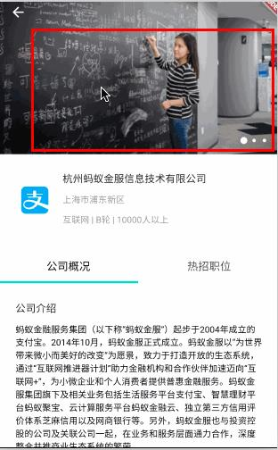 

```
import 'dart:math';
import 'package:flutter/material.dart';

class DotsIndicator extends AnimatedWidget {
  DotsIndicator({
    this.controller,
    this.itemCount,
    this.onPageSelected,
    this.color: Colors.white,
  }) : super(listenable: controller);

  final PageController controller;
  final int itemCount;
  final ValueChanged<int> onPageSelected;
  final Color color;
  static const double _kDotSize = 5.0;
  static const double _kMaxZoom = 2.0;
  static const double _kDotSpacing = 15.0;

  Widget _buildDot(int index) {
    double selectedness = Curves.easeOut.transform(
      max(
        0.0,
        1.0 - ((controller.page ?? controller.initialPage) - index).abs(),
      ),
    );
    double zoom = 1.0 + (_kMaxZoom - 1.0) * selectedness;
    return new Container(
      width: _kDotSpacing,
      child: new Material(
        color: color,
        type: MaterialType.circle,
        child: new Container(
          width: _kDotSize * zoom,
          height: _kDotSize * zoom,
          child: new InkWell(
            onTap: () => onPageSelected(index),
          ),
        ),
      ),
    );
  }

  Widget build(BuildContext context) {
    return new Row(
      mainAxisAlignment: MainAxisAlignment.center,
      children: new List<Widget>.generate(itemCount, _buildDot),
    );
  }
}

class IndicatorViewPager extends StatefulWidget {

  final List<Widget> _pages;

  IndicatorViewPager(this._pages);

  @override
  State createState() => new IndicatorViewPagerState();
}

class IndicatorViewPagerState extends State<IndicatorViewPager> {

  final _controller = new PageController();
  static const _kDuration = const Duration(milliseconds: 300);
  static const _kCurve = Curves.ease;
  final _kArrowColor = Colors.black.withOpacity(0.8);

  @override
  Widget build(BuildContext context) {
    return new Scaffold(
      body: new IconTheme(
        data: new IconThemeData(color: _kArrowColor),
        child: new Stack(
          children: <Widget>[
            new PageView.builder(
              physics: new AlwaysScrollableScrollPhysics(),
              controller: _controller,
              itemBuilder: (BuildContext context, int index) {
                return widget._pages[index % widget._pages.length];
              },
            ),
            new Positioned(
              bottom: 0.0,
              right: 0.0,
              child: new Container(
                // color: Colors.grey[800].withOpacity(0.5),
                  padding: const EdgeInsets.all(15.0),
                  child:
                  new DotsIndicator(
                    controller: _controller,
                    itemCount: widget._pages.length,
                    onPageSelected: (int page) {
                      _controller.animateToPage(
                        page,
                        duration: _kDuration,
                        curve: _kCurve,
                      );
                    },
                  )
              ),
            ),
          ],
        ),
      ),
    );
  }
}

```


## view/jobs_view.dart  职位Tab页面内容实现
 

```
import 'package:flutter/material.dart';
import 'package:flutter_app/app/item/joblist_item.dart';
import 'package:flutter_app/app/model/job.dart';

class JobsTab extends StatefulWidget {
  @override
  JobList createState() => new JobList();
}

class JobList extends State<JobsTab> {

  List<Job> _jobs = [];

  @override
  void initState() {
    super.initState();
    getJobList();
  }

  @override
  Widget build(BuildContext context) {
    return new Scaffold(
      backgroundColor: new Color.fromARGB(255, 242, 242, 245),
      appBar: new AppBar(
        elevation: 0.0,
        title: new Text('Android',
            style: new TextStyle(fontSize: 20.0, color: Colors.white)),
      ),
      body: new ListView.builder(
          itemCount: _jobs.length, itemBuilder: buildJobItem),
    );
  }

  buildJobItem(BuildContext context, int index) {
    Job job = _jobs[index];

    var jobItem = new InkWell(
        onTap: () {
          showDialog(context: context, child: new AlertDialog(
              content: new Text(
                "尽情期待!",
                style: new TextStyle(fontSize: 20.0),
              )));
        },
        child: new JobListItem(job)
    );

    return jobItem;
  }

  void getJobList() {
    setState(() {
      _jobs = Job.fromJson("""
          {
            "list": [
              {
                "name": "架构师（Android）",
                "cname": "蚂蚁金服",
                "size": "B轮",
                "salary": "25k-45k",
                "username": "Claire",
                "title": "HR"
              },
              {
                "name": "资深Android架构师",
                "cname": "今日头条",
                "size": "D轮",
                "salary": "40k-60k",
                "username": "Kimi",
                "title": "HRBP"
              }
            ]
          }
      """);
    });
  }

}


```


## item/joblist_item.dart
职位主tab页面ListView的Item视图
 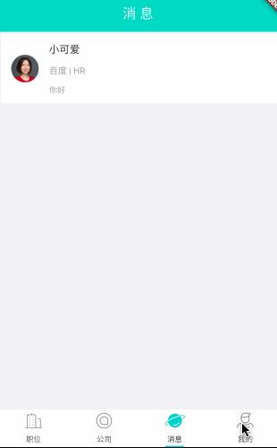
```
import 'package:flutter/material.dart';
import 'package:flutter_app/app/model/company.dart';

class CompanyListItem extends StatelessWidget {
  final Company company;

  CompanyListItem(this.company);

  @override
  Widget build(BuildContext context) {
    return new Padding(
      padding: const EdgeInsets.only(
        top: 3.0,
        left: 5.0,
        right: 5.0,
        bottom: 3.0,
      ),

      child: new SizedBox(
        child: new Card(
          elevation: 0.0,
          child: new Row(
            crossAxisAlignment: CrossAxisAlignment.start,
            children: <Widget>[
              new Padding(
                padding: const EdgeInsets.only(
                  top: 10.0,
                  left: 15.0,
                  right: 15.0,
                  bottom: 0.0,
                ),
                child: new Image.network(
                  company.logo,
                  width: 50.0,
                  height: 50.0,),
              ),

              new Expanded(
                child: new Column(
                  crossAxisAlignment: CrossAxisAlignment.start,
                  mainAxisSize: MainAxisSize.min,
                  children: <Widget>[
                    new Container(
                      child: new Text(
                        company.name,
                        textAlign: TextAlign.left,
                        style: new TextStyle(fontSize: 15.0),
                      ),
                      margin: const EdgeInsets.only(top: 10.0, bottom: 5.0),
                    ),

                    new Padding(
                      padding: const EdgeInsets.only(
                        top: 5.0,
                        left: 0.0,
                        right: 5.0,
                        bottom: 5.0,
                      ),
                      child: new Text(company.location, style: new TextStyle(
                          fontSize: 13.0, color: Colors.grey)),
                    ),

                    new Padding(
                      padding: const EdgeInsets.only(
                        top: 5.0,
                        left: 0.0,
                        right: 5.0,
                        bottom: 5.0,
                      ),
                      child: new Text(
                          company.type + " | " + company.size + " | " +
                              company.employee, style: new TextStyle(
                          fontSize: 13.0, color: Colors.grey)),
                    ),

                    new Divider(),
                    new Row(
                      children: <Widget>[
                        new Padding(
                          padding: const EdgeInsets.only(
                            top: 5.0,
                            left: 0.0,
                            right: 5.0,
                            bottom: 15.0,
                          ),
                          child: new Text(
                              "热招：" + company.hot + " 等" + company.count +
                                  "个职位", style: new TextStyle(
                              fontSize: 13.0, color: Colors.grey)),
                        ),
                        new Expanded(child: new Column(
                          crossAxisAlignment: CrossAxisAlignment.end,
                          children: <Widget>[
                            new Padding(
                              padding: const EdgeInsets.only(
                                bottom: 8.0,
                              ),
                              child: const Icon(
                                Icons.keyboard_arrow_right,
                                color: Colors.grey,),
                            ),
                          ],
                        ))
                      ],
                    ),
                  ],
                ),
              ),
            ],
          ),
        ),
      ),
    );
  }
}

```


## view/message_view.dart  消息Tab页面内容实现
 

```
import 'package:flutter/material.dart';
import 'package:flutter_app/app/item/messagelist_item.dart';
import 'package:flutter_app/app/model/message.dart';

class MessageTab extends StatefulWidget {
  @override
  MessageList createState() => new MessageList();
}

class MessageList extends State<MessageTab> {

  List<Message> _messages = [];

  @override
  void initState() {
    super.initState();
    getMessageList();
  }

  @override
  Widget build(BuildContext context) {
    return new Scaffold(
      backgroundColor: new Color.fromARGB(255, 242, 242, 245),
      appBar: new AppBar(
        elevation: 0.0,
        centerTitle: true,
        title: new Text(
            '消 息', style: new TextStyle(fontSize: 20.0, color: Colors.white)),
      ),
      body: new ListView.builder(
          itemCount: _messages.length, itemBuilder: buildCompanyItem),
    );
  }

  buildCompanyItem(BuildContext context, int index) {
    Message message = _messages[index];

    var messageItem = new GestureDetector(
        onTap: () {
          showDialog(context: context, child: new AlertDialog(
              content: new Text(
                "尽情期待!",
                style: new TextStyle(fontSize: 20.0),
              )));
        },
        child: new MessageListItem(message)
    );

    return messageItem;
  }

  void getMessageList() {
    setState(() {
      _messages = Message.fromJson("""
          {
            "list": [
              {
                "avatar": "https://img.bosszhipin.com/beijin/mcs/useravatar/20180301/17aefca1b3d0dd6c5f94409e4c1e42a2cfcd208495d565ef66e7dff9f98764da_s.jpg",
                "name": "小可爱",
                "company": "百度",
                "position": "HR",
                "msg": "你好"
              }
            ]
          }
      """);
    });
  }
}


```


## item/messagelist_item.dart
消息主tab页面ListView的Item视图
 
```
import 'package:flutter/material.dart';
import 'package:flutter_app/app/model/company.dart';

class CompanyListItem extends StatelessWidget {
  final Company company;

  CompanyListItem(this.company);

  @override
  Widget build(BuildContext context) {
    return new Padding(
      padding: const EdgeInsets.only(
        top: 3.0,
        left: 5.0,
        right: 5.0,
        bottom: 3.0,
      ),

      child: new SizedBox(
        child: new Card(
          elevation: 0.0,
          child: new Row(
            crossAxisAlignment: CrossAxisAlignment.start,
            children: <Widget>[
              new Padding(
                padding: const EdgeInsets.only(
                  top: 10.0,
                  left: 15.0,
                  right: 15.0,
                  bottom: 0.0,
                ),
                child: new Image.network(
                  company.logo,
                  width: 50.0,
                  height: 50.0,),
              ),

              new Expanded(
                child: new Column(
                  crossAxisAlignment: CrossAxisAlignment.start,
                  mainAxisSize: MainAxisSize.min,
                  children: <Widget>[
                    new Container(
                      child: new Text(
                        company.name,
                        textAlign: TextAlign.left,
                        style: new TextStyle(fontSize: 15.0),
                      ),
                      margin: const EdgeInsets.only(top: 10.0, bottom: 5.0),
                    ),

                    new Padding(
                      padding: const EdgeInsets.only(
                        top: 5.0,
                        left: 0.0,
                        right: 5.0,
                        bottom: 5.0,
                      ),
                      child: new Text(company.location, style: new TextStyle(
                          fontSize: 13.0, color: Colors.grey)),
                    ),

                    new Padding(
                      padding: const EdgeInsets.only(
                        top: 5.0,
                        left: 0.0,
                        right: 5.0,
                        bottom: 5.0,
                      ),
                      child: new Text(
                          company.type + " | " + company.size + " | " +
                              company.employee, style: new TextStyle(
                          fontSize: 13.0, color: Colors.grey)),
                    ),

                    new Divider(),
                    new Row(
                      children: <Widget>[
                        new Padding(
                          padding: const EdgeInsets.only(
                            top: 5.0,
                            left: 0.0,
                            right: 5.0,
                            bottom: 15.0,
                          ),
                          child: new Text(
                              "热招：" + company.hot + " 等" + company.count +
                                  "个职位", style: new TextStyle(
                              fontSize: 13.0, color: Colors.grey)),
                        ),
                        new Expanded(child: new Column(
                          crossAxisAlignment: CrossAxisAlignment.end,
                          children: <Widget>[
                            new Padding(
                              padding: const EdgeInsets.only(
                                bottom: 8.0,
                              ),
                              child: const Icon(
                                Icons.keyboard_arrow_right,
                                color: Colors.grey,),
                            ),
                          ],
                        ))
                      ],
                    ),
                  ],
                ),
              ),
            ],
          ),
        ),
      ),
    );
  }
}
```


## view/mine_view.dart  个人信息Tab页面内容实现
 
```
import 'package:flutter/material.dart';

class MineTab extends StatelessWidget {

  final double _appBarHeight = 150.0;

  @override
  Widget build(BuildContext context) {
    return new Scaffold(
      backgroundColor: new Color.fromARGB(255, 242, 242, 245),
      body: new CustomScrollView(
        slivers: <Widget>[
          new SliverAppBar(
            expandedHeight: _appBarHeight,
            flexibleSpace: new FlexibleSpaceBar(
              background: new Stack(
                fit: StackFit.expand,
                children: <Widget>[
                  const DecoratedBox(
                    decoration: const BoxDecoration(
                      gradient: const LinearGradient(
                        begin: const Alignment(0.0, -1.0),
                        end: const Alignment(0.0, -0.4),
                        colors: const <Color>[
                          const Color(0x00000000), const Color(0x00000000)],
                      ),
                    ),
                  ),

                  new Row(
                    mainAxisAlignment: MainAxisAlignment.start,
                    children: [
                      new Padding(
                        padding: const EdgeInsets.only(
                          top: 20.0,
                          left: 30.0,
                          right: 20.0,
                        ),
                        child: new CircleAvatar(
                          radius: 35.0,
                          backgroundImage: new NetworkImage('https://img.bosszhipin.com/beijin/mcs/useravatar/20171211/4d147d8bb3e2a3478e20b50ad614f4d02062e3aec7ce2519b427d24a3f300d68_s.jpg')
                        )
                      ),

                      new Row(
                        children: <Widget>[
                          new Column(
                            mainAxisAlignment: MainAxisAlignment.center,
                            children: [
                              new Padding(
                                  padding: const EdgeInsets.only(
                                    top: 10.0,
                                    bottom: 10.0,
                                  ),
                                  child: new Text('kimi he',
                                      style: new TextStyle(
                                          color: Colors.white, fontSize: 18.0))
                              ),
                              new Text('在职-考虑机会',
                                  style: new TextStyle(
                                      color: Colors.white, fontSize: 12.0)
                              ),
                            ],
                          ),
                        ],
                      ),
                    ],
                  ),
                ],
              ),
            ),
          ),

          new SliverList(
              delegate: new SliverChildListDelegate(<Widget>[
                new Container(
                  color: Colors.white,
                  child: new Padding(
                    padding: const EdgeInsets.only(
                      top: 10.0,
                      bottom: 10.0,
                    ),
                    child: new Row(
                      mainAxisAlignment: MainAxisAlignment.spaceAround,
                      children: [
                        new _ContactItem(
                          onPressed: () {
                            showDialog(context: context, child: new AlertDialog(
                                content: new Text(
                                  "沟通过",
                                  style: new TextStyle(fontSize: 20.0),
                                )));
                          },
                          count: '590',
                          title: '沟通过',
                        ),
                        new _ContactItem(
                          onPressed: () {
                            showDialog(context: context, child: new AlertDialog(
                                content: new Text(
                                  "已沟通",
                                  style: new TextStyle(fontSize: 20.0),
                                )));
                          },
                          count: '71',
                          title: '已沟通',
                        ),
                        new _ContactItem(
                          onPressed: () {
                            showDialog(context: context, child: new AlertDialog(
                                content: new Text(
                                  "已沟通",
                                  style: new TextStyle(fontSize: 20.0),
                                )));
                          },
                          count: '0',
                          title: '待面试',
                        ),
                      ],
                    ),
                  ),
                ),
              ])
          )
        ],
      ),
    );
  }
}

class _ContactItem extends StatelessWidget {
  _ContactItem({ Key key, this.count, this.title, this.onPressed })
      : super(key: key);

  final String count;
  final String title;
  final VoidCallback onPressed;

  @override
  Widget build(BuildContext context) {
    return new GestureDetector(
        onTap: onPressed,
        child: new Column(
          children: [
            new Padding(
              padding: const EdgeInsets.only(
                bottom: 10.0,
              ),
              child: new Text(count, style: new TextStyle(
                  fontSize: 22.0)),
            ),
            new Text(title),
          ],
        )
    );
  }
}


```


##view/company/company_view.dart  公司信息主页Tab页面内容实现
 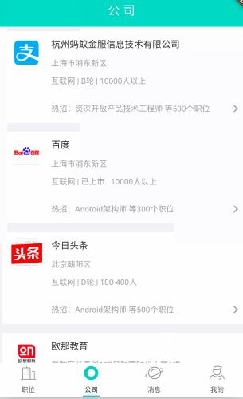   
```
import 'package:flutter/material.dart';
import 'package:flutter_app/app/item/companylist_item.dart';
import 'package:flutter_app/app/model/company.dart';
import 'package:flutter_app/app/view/company/company_detail.dart';

class CompanyTab extends StatefulWidget {
  @override
  CompanyList createState() => new CompanyList();
}

class CompanyList extends State<CompanyTab> {

  List<Company> _companties = [];

  @override
  void initState() {
    super.initState();
    getCompanyList();
  }

  @override
  Widget build(BuildContext context) {
    return new Scaffold(
      backgroundColor: new Color.fromARGB(255, 242, 242, 245),
      appBar: new AppBar(
        elevation: 0.0,
        centerTitle: true,
        title: new Text(
            '公 司', style: new TextStyle(fontSize: 20.0, color: Colors.white)),
//        actions: <Widget>[
//          new IconButton(
//            icon: new Icon(Icons.find_in_page, color: Colors.white,),
//            onPressed: () {
//              print('onclick');
//            },
//          )
//        ],
      ),
      body: new ListView.builder(
          itemCount: _companties.length, itemBuilder: buildCompanyItem),
    );
  }

  buildCompanyItem(BuildContext context, int index) {
    Company company = _companties[index];

    var companyItem = new InkWell(
        onTap: () => navCompanyDetail(company, index),
        child: new CompanyListItem(company)
    );

    return companyItem;
  }

  void getCompanyList() {
    setState(() {
      _companties = Company.fromJson("""
          {
            "list": [
               {
                "logo": "https://img.bosszhipin.com/beijin/mcs/chatphoto/20161230/b0df9f099f1d6db1937bc78068fb4c15760bb3f59f760cd45f5945e615392f6f.jpg",
                "name": "杭州蚂蚁金服信息技术有限公司",
                "location": "上海市浦东新区",
                "type": "互联网",
                "size": "B轮",
                "employee": "10000人以上",
                "hot": "资深开放产品技术工程师",
                "count": "500",
                "inc": "蚂蚁金融服务集团（以下称“蚂蚁金服”）起步于2004年成立的支付宝。2014年10月，蚂蚁金服正式成立。蚂蚁金服以“为世界带来微小而美好的改变”为愿景，致力于打造开放的生态系统，通过“互联网推进器计划”助力金融机构和合作伙伴加速迈向“互联网+”，为小微企业和个人消费者提供普惠金融服务。蚂蚁金服集团旗下及相关业务包括生活服务平台支付宝、智慧理财平台蚂蚁聚宝、云计算服务平台蚂蚁金融云、独立第三方信用评价体系芝麻信用以及网商银行等。另外，蚂蚁金服也与投资控股的公司及关联公司一起，在业务和服务层面通力合作，深度整合共推商业生态系统的繁荣。"
              },
              {
                "logo": "https://img.bosszhipin.com/beijin/mcs/chatphoto/20170927/60158fe74a9233b55ee08206ca5df1dccfcd208495d565ef66e7dff9f98764da.jpg",
                "name": "百度",
                "location": "上海市浦东新区",
                "type": "互联网",
                "size": "已上市",
                "employee": "10000人以上",
                "hot": "Android架构师",
                "count": "300",
                "inc": "百度（纳斯达克：BIDU），全球最大的中文搜索引擎、最大的中文网站。1999年底,身在美国硅谷的李彦宏看到了中国互联网及中文搜索引擎服务的巨大发展潜力，抱着技术改变世界的梦想，他毅然辞掉硅谷的高薪工作，携搜索引擎专利技术，于 2000年1月1日在中关村创建了百度公司。“百度”二字,来自于八百年前南宋词人辛弃疾的一句词：众里寻他千百度。这句话描述了词人对理想的执着追求。"
              },
              {
                "logo": "https://img.bosszhipin.com/beijin/mcs/chatphoto/20170420/9e7ec542865511eb31273086b78598e355d0075cc85bc70bb61f658db0db4c2c.jpg",
                "name": "今日头条",
                "location": "北京朝阳区",
                "type": "互联网",
                "size": "D轮",
                "employee": "100-400人",
                "hot": "Android架构师",
                "count": "500",
                "inc": "【字节跳动】字节跳动成立于2012年3月，是一家技术驱动的移动互联网公司，公司致力于采用先进的推荐引擎技术，提供基于移动设备的信息分发解决方案。 "
              },
              {
                "logo": "https://img2.bosszhipin.com/mcs/chatphoto/20160317/5d308646e6e4bc4e68d5f97a74c14dcda2d41b7cc34321f537d83206460d4ca6.jpg",
                "name": "欧那教育",
                "location": "普陀区长寿路137号财富时代大厦6楼",
                "type": "互联网教育",
                "size": "A轮",
                "employee": "100-400人",
                "hot": "app技术经理",
                "count": "50",
                "inc": "随着中外交流的不断深入，需要越来越多掌握小语种的高端人才，也有越来越多的中国人选择到德国、法国、俄罗斯、西班牙等国家留学。但小语种教育资源在地域上分配很不平衡，许多小语种学习者在周边找不到优秀的小语种老师，许多小型小语种培训学校受限于资源也无力研发真正高质量的课程。上海云兜网络科技有限公司旗下欧那教育，是国内最早开始在线小语种培训机构，首创“真人在线实时教学”的互联网学习模式，通过最有效的沉浸式学习，打破传统的外语培训“知识堆积”的学习模式。全球数十位语言专家和教育专家组成的欧那教研团队研发的适合中国人学习的“极致·地道·匠心独具”的小语种语课程，帮助中国人用最快捷有效的方式，达成外语水平的提升。优质的中外籍师资、经济实惠的价格和全球专家研发的专业小语种课程赢得了数千位小语种学习者的认可和好评。我们相信互联网平等开放的力量，相信用优质的课程、实惠的价格、真诚的服务，让数百万对小语种学习和生活怀抱着热爱和执着，渴望通过努力改变生活改变未来的普通人，从见证小小改变的发生，到实现大大的梦想：）"
              },
              {
                "logo": "https://img.bosszhipin.com/beijin/mcs/chatphoto/20180120/feecd69f373a2a8b1189df93a0f6fd84cfcd208495d565ef66e7dff9f98764da.jpg",
                "name": "领健信息",
                "location": "上海市浦东新区",
                "type": "互联网",
                "size": "B轮",
                "employee": "500人以上",
                "hot": "前端工程师",
                "count": "100",
                "inc": "上海领健信息技术有限公司创立于2015年5月，2015年8月获得顶级投资机构经纬中国天使投资，2016年1月完成A轮融资，丁香园领投，天使投资人经纬中国继续跟进。"
              },
              {
                "logo": "https://img2.bosszhipin.com/mcs/chatphoto/20160220/6042752606dc6957d81c5f08f409db8e5e01c286644ac62b728b8918eb85ca28.jpg",
                "name": "平安银行",
                "location": "上海徐汇区平安大厦凯滨路206号",
                "type": "互联网",
                "size": "已上市",
                "employee": "10000人以上",
                "hot": "前端架构师",
                "count": "400",
                "inc": "平安银行，全称平安银行股份有限公司，是中国平安保险（集团）股份有限公司控股的一家跨区域经营的股份制商业银行，为中国大陆12家全国性股份制商业银行之一，总部位于广东省深圳市。中国平安保险（集团）股份有限公司（以下简称“中国平安”）及其控股子公司为平安银行的控股股东。"
              },
              {
                "logo": "https://www.lgstatic.com/thumbnail_160x160/i/image2/M00/2C/FA/CgoB5lowjbmAHxUGAAA2tROA4LA987.jpg",
                "name": "蘑菇租房",
                "location": "上海市静安区",
                "type": "互联网",
                "size": "C轮",
                "employee": "1000人以上",
                "hot": "IOS工程师",
                "count": "200",
                "inc": "蘑菇租房是国内领先的真实租房平台，2014年蘑菇租房从品牌长租公寓起步，蘑菇租房的前身蘑菇公寓致力于为都市白领创造高品质居住生活。"
              }
            ]
          }
      """);
    });
  }

  navCompanyDetail(Company company, int index) {
    Navigator.of(context).push(new PageRouteBuilder(
        opaque: false,
        pageBuilder: (BuildContext context, _, __) {
          return new CompanyDetail(company);
        },
        transitionsBuilder: (_, Animation<double> animation, __, Widget child) {
          return new FadeTransition(
            opacity: animation,
            child: new SlideTransition(position: new Tween<Offset>(
              begin: const Offset(0.0, 1.0),
              end: Offset.zero,
            ).animate(animation), child: child),
          );
        }
    ));
  }
}


```

##view/company/company_detail.dart  
公司详细信息页面ListView的Item视图
 
```
import 'package:flutter/material.dart';
import 'package:flutter_app/app/model/company.dart';

class CompanyListItem extends StatelessWidget {
  final Company company;

  CompanyListItem(this.company);

  @override
  Widget build(BuildContext context) {
    return new Padding(
      padding: const EdgeInsets.only(
        top: 3.0,
        left: 5.0,
        right: 5.0,
        bottom: 3.0,
      ),

      child: new SizedBox(
        child: new Card(
          elevation: 0.0,
          child: new Row(
            crossAxisAlignment: CrossAxisAlignment.start,
            children: <Widget>[
              new Padding(
                padding: const EdgeInsets.only(
                  top: 10.0,
                  left: 15.0,
                  right: 15.0,
                  bottom: 0.0,
                ),
                child: new Image.network(
                  company.logo,
                  width: 50.0,
                  height: 50.0,),
              ),

              new Expanded(
                child: new Column(
                  crossAxisAlignment: CrossAxisAlignment.start,
                  mainAxisSize: MainAxisSize.min,
                  children: <Widget>[
                    new Container(
                      child: new Text(
                        company.name,
                        textAlign: TextAlign.left,
                        style: new TextStyle(fontSize: 15.0),
                      ),
                      margin: const EdgeInsets.only(top: 10.0, bottom: 5.0),
                    ),

                    new Padding(
                      padding: const EdgeInsets.only(
                        top: 5.0,
                        left: 0.0,
                        right: 5.0,
                        bottom: 5.0,
                      ),
                      child: new Text(company.location, style: new TextStyle(
                          fontSize: 13.0, color: Colors.grey)),
                    ),

                    new Padding(
                      padding: const EdgeInsets.only(
                        top: 5.0,
                        left: 0.0,
                        right: 5.0,
                        bottom: 5.0,
                      ),
                      child: new Text(
                          company.type + " | " + company.size + " | " +
                              company.employee, style: new TextStyle(
                          fontSize: 13.0, color: Colors.grey)),
                    ),

                    new Divider(),
                    new Row(
                      children: <Widget>[
                        new Padding(
                          padding: const EdgeInsets.only(
                            top: 5.0,
                            left: 0.0,
                            right: 5.0,
                            bottom: 15.0,
                          ),
                          child: new Text(
                              "热招：" + company.hot + " 等" + company.count +
                                  "个职位", style: new TextStyle(
                              fontSize: 13.0, color: Colors.grey)),
                        ),
                        new Expanded(child: new Column(
                          crossAxisAlignment: CrossAxisAlignment.end,
                          children: <Widget>[
                            new Padding(
                              padding: const EdgeInsets.only(
                                bottom: 8.0,
                              ),
                              child: const Icon(
                                Icons.keyboard_arrow_right,
                                color: Colors.grey,),
                            ),
                          ],
                        ))
                      ],
                    ),
                  ],
                ),
              ),
            ],
          ),
        ),
      ),
    );
  }
}

```


##view/company/company_detail.dart  公司详细信息页面
 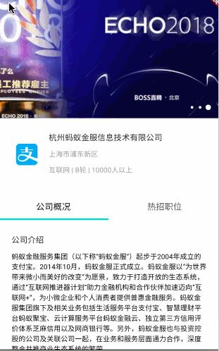
```
import 'package:flutter/material.dart';
import 'package:flutter_app/app/component/indicator_viewpager.dart';
import 'package:flutter_app/app/model/company.dart';
import 'package:flutter_app/app/view/company/company_hot_job.dart';
import 'package:flutter_app/app/view/company/company_inc.dart';
import 'package:flutter_app/app/view/company/company_info.dart';

enum AppBarBehavior { normal, pinned, floating, snapping }

const double _kAppBarHeight = 256.0;

class CompanyDetail extends StatefulWidget {

  final Company _company;

  CompanyDetail(this._company);

  @override
  CompanyDetailState createState() => new CompanyDetailState();
}

class CompanyDetailState extends State<CompanyDetail>
    with TickerProviderStateMixin {

  List<Tab> _tabs;
  List<Widget> _imagePages;
  TabController _controller;
  List<String> _urls = [
    'https://img.bosszhipin.com/beijin/mcs/chatphoto/20170725/861159df793857d6cb984b52db4d4c9c.jpg',
    'https://img2.bosszhipin.com/mcs/chatphoto/20151215/a79ac724c2da2a66575dab35384d2d75532b24d64bc38c29402b4a6629fcefd6_s.jpg',
    'https://img.bosszhipin.com/beijin/mcs/chatphoto/20180207/c15c2fc01c7407b98faf4002e682676b.jpg'
  ];
  Widget _companyTabContent;
  VoidCallback onChanged;
  int _currentIndex = 0;

  @override
  void initState() {
    super.initState();
    if (!_urls.isEmpty) {
      _imagePages = <Widget>[];
      _urls.forEach((String url) {
        _imagePages.add(
            new Container(
                color: Colors.black.withAlpha(900),
                child: new ConstrainedBox(
                  constraints: const BoxConstraints.expand(),
                  child: new Image.network(
                    url,
                    fit: BoxFit.cover,
                    height: _kAppBarHeight,
                  ),
                ))
        );
      });
    }
    _tabs = [
      new Tab(text: '公司概况'),
      new Tab(text: '热招职位'),
    ];
    _companyTabContent = new CompanyInc(widget._company.inc);
    _controller = new TabController(length: _tabs.length, vsync: this);
    onChanged = () {
      setState(() {
        if (_currentIndex == 0) {
          _companyTabContent = new CompanyInc(widget._company.inc);
        } else {
          _companyTabContent = new CompanyHotJob();
        }
        _currentIndex = this._controller.index;
      });
    };

    _controller.addListener(onChanged);
  }

  @override
  void dispose() {
    _controller.removeListener(onChanged);
    _controller.dispose();
    super.dispose();
  }

  @override
  Widget build(BuildContext context) {
    return new Scaffold(
        backgroundColor: new Color.fromARGB(255, 242, 242, 245),
        body: new Stack(
          children: <Widget>[
            new SingleChildScrollView(
                child: new Column(
                  children: <Widget>[
                    new SizedBox.fromSize(
                      size: const Size.fromHeight(_kAppBarHeight),
                      child: new IndicatorViewPager(_imagePages),
                    ),

                    new Container(
                      color: Colors.white,
                      child: new Column(
                        children: <Widget>[
                          new CompanyInfo(widget._company),
                          new Divider(),
                          new TabBar(
                            indicatorWeight: 3.0,
                            indicatorSize: TabBarIndicatorSize.tab,
                            labelStyle: new TextStyle(fontSize: 16.0),
                            labelColor: Colors.black,
                            controller: _controller,
                            tabs: _tabs,
                            indicatorColor: Theme
                                .of(context)
                                .primaryColor,
                          ),
                        ],
                      ),
                    ),
                    _companyTabContent
                  ],
                )
            ),

            new Positioned(
              top: 10.0,
              left: -10.0,
              child: new Container(
                  padding: const EdgeInsets.all(15.0),
                  child: new BackButton(color: Colors.white)
              ),
            ),
          ],
        )
    );
  }
}

```


##view/company/company_info.dart  
公司详细信息页面中的公司的信息展示的View
 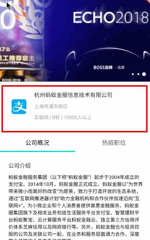
```
import 'package:flutter/cupertino.dart';
import 'package:flutter/material.dart';
import 'package:flutter_app/app/model/company.dart';

class CompanyInfo extends StatelessWidget {

  final Company company;

  CompanyInfo(this.company);

  @override
  Widget build(BuildContext context) {
    return new Padding(
      padding: const EdgeInsets.all(10.0),
      child: new SizedBox(
        child: new Card(
          elevation: 0.0,
          child: new Row(
            children: <Widget>[
              new Padding(
                padding: const EdgeInsets.only(
                  top: 10.0,
                  left: 15.0,
                  right: 15.0,
                  bottom: 0.0,
                ),
                child: new Image.network(
                  company.logo,
                  width: 50.0,
                  height: 50.0,),
              ),

              new Expanded(
                child: new Column(
                  crossAxisAlignment: CrossAxisAlignment.start,
                  mainAxisSize: MainAxisSize.min,
                  children: <Widget>[
                    new Container(
                      child: new Text(
                        company.name,
                        textAlign: TextAlign.left,
                        style: new TextStyle(fontSize: 15.0),
                      ),
                      margin: const EdgeInsets.only(top: 10.0, bottom: 5.0),
                    ),

                    new Padding(
                      padding: const EdgeInsets.only(
                        top: 5.0,
                        left: 0.0,
                        right: 5.0,
                        bottom: 5.0,
                      ),
                      child: new Text(company.location, style: new TextStyle(
                          fontSize: 13.0, color: Colors.grey)),
                    ),

                    new Padding(
                      padding: const EdgeInsets.only(
                        top: 5.0,
                        left: 0.0,
                        right: 5.0,
                        bottom: 5.0,
                      ),
                      child: new Text(
                          company.type + " | " + company.size + " | " +
                              company.employee, style: new TextStyle(
                          fontSize: 13.0, color: Colors.grey)),
                    ),
                  ],
                ),
              ),
            ],
          ),
        ),
      ),
    );
  }
}


```


##view/company/company_inc.dart  
公司详细信息页面中的公司概况tab的内容View
 
```
import 'package:flutter/cupertino.dart';
import 'package:flutter/material.dart';

class CompanyInc extends StatelessWidget {

  final String _companyInc;

  CompanyInc(this._companyInc);

  @override
  Widget build(BuildContext context) {
    return new Padding(
      padding: const EdgeInsets.only(
        top: 10.0,
        left: 10.0,
        right: 10.0,
        bottom: 10.0,
      ),
      child: new Container(
          color: Colors.white,
          child: new Padding(
              padding: const EdgeInsets.all(15.0),
              child: new Column(
                children: <Widget>[
                  new Row(
                    children: <Widget>[
                      new Container(
                        margin: const EdgeInsets.only(bottom: 10.0),
                        child: new Text(
                            '公司介绍', style: new TextStyle(fontSize: 15.0)),
                      )
                    ],
                  ),

                  new RichText(
                    text: new TextSpan(
                      text: _companyInc,
                      style: new TextStyle(
                          fontSize: 13.0,
                          color: Colors.black
                      ),
                    ),
                  )
                ],
              )
          )
      ),
    );
  }
}
```


##view/company/company_hot_job.dart
公司详细信息页面中的热招职位tab的内容View
 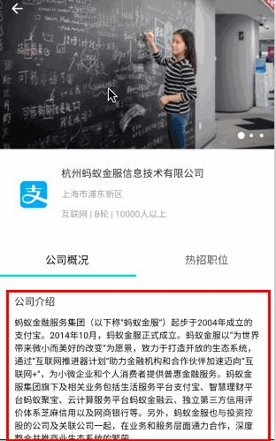
```

import 'package:flutter/cupertino.dart';
import 'package:flutter/material.dart';

class CompanyHotJob extends StatelessWidget {

  @override
  Widget build(BuildContext context) {
    return new Padding(
        padding: const EdgeInsets.only(
          top: 10.0,
          left: 10.0,
          right: 10.0,
          bottom: 10.0,
        ),
        child: new Row(
          children: <Widget>[
            new RichText(
              text: new TextSpan(
                text: '敬请期待',
                style: new TextStyle(
                    fontSize: 16.0,
                    color: Colors.black
                ),
              ),
            )
          ],
        )
    );
  }
}

```


#扣扣码
## main.dart   Splash.dart   文件分析
### 函数起点位置原型 void main() 
```
void main() { runApp(new MaterialApp(title:【x1.应用名称】 ,theme：【x2.应用使用的主题 ThemeData 】 ,home : 【x3.应用的主界面使用到的视图 Widget】)   }

void main() {
  runApp(new MaterialApp(
    title: "Boss直聘",
    theme: new ThemeData(
      primaryIconTheme: const IconThemeData(color: Colors.white),
      brightness: Brightness.light,
      primaryColor: new Color.fromARGB(255, 0, 215, 198),
      accentColor: Colors.cyan[300],
    ),
    home: new SplashPage()));
}
```

### theme参数名使用的主题为  ThemeData , 该 ThemeData的参数分析 
```
   new ThemeData(
   primaryIconTheme:【x2_1  IconThemeData(color: Colors.white)  Defines the color, opacity, and size of icons】   , 
   brightness : 【x2_2 主题风格: { Brightness.dark |  Brightness.light } 】 ,  
   primaryColor: 【x2_3 主题整体颜色 导航栏默认使用改颜色 Toolbar导航栏的底色  { Colors.blue ... Color.fromARGB(255, 0, 215, 198)} 】 ，
   accentColor: 【x2_4  CheckBox，RadioButton，Switch, Button 等控件采用的首选颜色 { Colors.blue ... Color.fromARGB(255, 0, 215, 198)}】 )
```

### home: 代表的是 当前页面的内容  必须是一个 Widget
    new MaterialApp(title: 'string', theme: ThemeData , home: Widget);
    
### 视图一个实现了Widget的   dart文件
```
【widget 必须 继承 extends StatefulWidget (可变)  并实现  override 方法createState() 并 在该方法内返回 具体的State状态类 】
   SplashPage的具体的内容  必须由一个  继承 extends State<SplashPage>  的 状态类State去实现， 这个 State 中 必须手动实现一个 Widget build(BuildContext context) {}  方法
   
class SplashPage extends StatefulWidget {
  @override
  SplashState createState() => new SplashState();
}

class SplashState extends State<SplashPage> {

  @override
  void initState() { 【如果有数据需要初始化  可以在该方法中处理  只在创建时执行一次 在 build函数之前执行】
  }
  
    @override
  void dispose() {【如果有数据需要在对象销毁前清楚  可以在该方法中处理  只在销毁前执行一次 】
  }
  
  
  @override
  Widget build(BuildContext context) { // 【在该方法中 去具体实现 SplashPage 中显示的内容 】
  }
  
}
```

### Widget build(BuildContext context){ Material } 函数分析 
```
Widget build(BuildContext context) { return new Material(color: 【定义该Material 视图对象的颜色 (在此定义了背景颜色)】, child: 该视图包含的内容( 一般就在这里完成视图的逻辑) )} 函数分析  一般

 @override
  Widget build(BuildContext context) {
    return new Material(
      color: xxxx,  
      child: xxxx,
    );
  }

```

###  Padding(widget) 对象说明
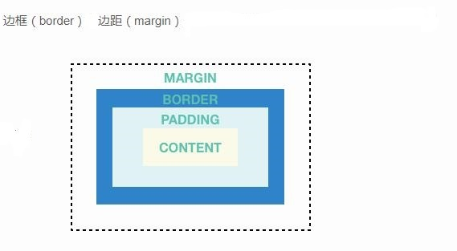
```
 Padding 对象说明： 该对象用于设置内容与边界的距离  调整内容显示的位置 ， 一般它所包含的 child( Widget )起作用
https://docs.flutter.io/flutter/widgets/Padding-class.html  A widget that insets its child by the given padding.
const EdgeInsets.only(left: 40.0)  离左边40像素
const EdgeInsets.only(right: 40.0)  
const EdgeInsets.only(top: 150.0)  离顶部150像素
const EdgeInsets.only(bottom: 150.0)  
const EdgeInsets.all(150.0)  上下左右 都间隔 100 像素
const EdgeInsets.fromLTRB(left:10,right: 40.0,top: 40.0,bottom: 150.0)  上下左右 都分别设置间隔
const EdgeInsets.symmetric( vertical: 10.0, double horizontal: 20.0 )  水平与竖直方向的位移


new Padding(padding:【边界距离的表示类 EdgeInsets ， const EdgeInsets.all(8.0) 上下左右都间隔8像素  ....】， child: 【Padding包含的内容 Widget】)
  
new Padding(
        padding: const EdgeInsets.only(top: 150.0,),
        child: new Column(children: <Widget>[new Text("BOSS直聘",style: new TextStyle(color: Colors.white,fontSize: 50.0,fontWeight: FontWeight.bold),),],
        ),
      ),
```
### Column(widget) 对象说明
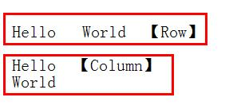
```
原型: new Column(children: <Widget>[ ]);
该类是一个widget的集合，用于包含那些垂直排列的 视图。它的参数 children是一个 <Widget>[ ] 视图的集合，这个集合的每一个元素垂直排布。 与他相对的排布容器是 Row实现水平排布，两个可相互嵌套实现复杂布局
 new Column(children: <Widget>[new Text("BOSS直聘",style: new TextStyle(color: Colors.white,fontSize: 50.0,fontWeight: FontWeight.bold),),],
 new Column(children: <Widget>[new Text("Hello"),new Text("World")]);    
```


### Row(widget) 对象说明

```
原型: new Row(children: <Widget>[ ]);
该类是一个widget的集合，用于包含那些水平排列的 视图。它的参数 children是一个 <Widget>[ ] 视图的集合，这个集合的每一个元素水平排布。
与他相对的排布容器是 Column 实现垂直排布，两个可相互嵌套实现复杂布局
 new Row(children: <Widget>[new Text("Hello"),new Text("World")]);    

```

### Text(widget) 对象说明
```
原型：  new Text(text: 显示的文本字符串 , style: 文本的样式_字体大小_字体颜色_字体加粗斜体等属性)
new Text(text:"BOSS直聘",
      style: new TextStyle(color: Colors.white, // 字体颜色
                           fontSize: 50.0,  // 字体大小
                           fontWeight: FontWeight.bold  ),), // 字体粗体
  ],
          
```


###  Timer 定时器对象说明
```
https://docs.flutter.io/flutter/dart-async/Timer-class.html
Timer 是一个定时执行 指定函数的对象  包含在'dart:async' 这个库中, 只要创建了  那么他就会在规定的时间内执行， 不需要直接调用 创建时 就可以用了
A count-down timer that can be configured to fire once or repeatedly.    Timer.tick 指定了执行的数量次数

原型:  Timer(Duration duration 【时间间隔】, void callback() 【执行函数】)

import 'dart:async';
class SplashState extends State<SplashPage> {
  Timer _t;
  
  @override
  void initState() {
  _t = new Timer(duration： const Duration(milliseconds: 1500),(){ // 匿名执行函数
  
   // 在此处执行匿名函数操作
  });
  }
  
  
    @override
  void dispose() {
    _t.cancel();   // 取消定时器任务
    super.dispose();
  }
  
```


### Navigator 页面导航，进入新页面
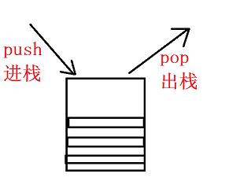
```
进入新页面路由:
Navigator.push(context, new MaterialPageRoute());

MaterialPageRoute 的参数 binder: 参数是一个当前路由页面显示的 widget ， 一般在该参数构造一个匿名返回widget的函数( 同 Widget Build(Context context)类似的函数)

void main() {
  runApp(new MaterialApp(home: new MyAppHome()));
}


Navigator.push(context, new MaterialPageRoute(
  builder: (BuildContext context) {
    return new Scaffold(
      appBar: new AppBar(title: new Text('My Page')),
      body: new Center(
        child: new FlatButton(
          child: new Text('POP'),
          onPressed: () {
            Navigator.pop(context);
          },
        ),
      ),
    );
  },
));
--------------------------------

进入新页面，同时把当前页面及之前给销毁掉的方法
Navigator.of(context).pushAndRemoveUntil( new MaterialPageRoute( builder: widget )， predicate:【预制条件 把之前的路由都设置出栈 直到该函数返回true】  );

try {
    Navigator.of(context).pushAndRemoveUntil(new MaterialPageRoute(
        builder: (BuildContext context) => new BossApp()), 
        predicate: (Route route) => route == null 【当当前的路由为空 停止出栈 进入新的路由】);
  } catch (e) {

  }
      
```


##home.dart   文件分析

```

class BossApp extends StatefulWidget {
  @override
  HomeState createState() => new HomeState();
}

class HomeState extends State<BossApp> with SingleTickerProviderStateMixin {
  int _currentIndex = 0;    //【当前页面索引】
  TabController _controller;   【tab的控制器】
  VoidCallback onChanged;    // tab点击事件回调函数

  @override
  void initState() {
    super.initState();
    _controller =
    new TabController(initialIndex: _currentIndex, length: 4, vsync: this);  【当前Tab的初始索引值 ， 长度 ，以及当前类( 用于同步UI) 】
    onChanged = () {
      setState(() {
        _currentIndex = this._controller.index;   // 更改当前选中的页面的标记变量 _currentIndex
      });
    };

    _controller.addListener(onChanged);  // 设置回调函数为 onChanged 
  }
  


  void dispose() {
    _controller.removeListener(onChanged);   // 释放各种锁 析构资源
    _controller.dispose();
    super.dispose();
  }
  
```


**Tab主页面的build画面构造函数**
```
 // 底部导航栏 配置的widget为 TabBar( controller: tabBarController,tabs: <IconTab>[new IconTab(icon: , text,: color:),new IconTab() ,new IconTab()] )
  Scaffold(body: new TabbarView( children:  <Widget>[extends StatefulWidget xxxxx ]  ,  controller:Tabcontroller )
 
 
 //【 JobsTab extends StatefulWidget   CompanyTab extends StatefulWidget   MessageTab extends StatefulWidget .....   四个显示的内容Widget包含在TabBarView的 children中】
 //  icon:  "assets/images/ic_main_tab_company_pre.png"  用于引用 assert 中的图片资源

 Scaffold(bottomNavigationBar: new Material(child:  new TabBar( 
 tabs:<IconTab>[new IconTab(icon:'image_url' , color:,text) ] ,
 controller:Tabcontroller

 )
  )
   )
```


```

  @override
  Widget build(BuildContext context) {
    return new Scaffold(
      body: new TabBarView(    //【TabBarView(children: <Widget>[ ] ， controller： TabController); body:TabBarView 内容为 TabBarView 】
        children: <Widget>[    
//【 JobsTab extends StatefulWidget   CompanyTab extends StatefulWidget   MessageTab extends StatefulWidget .....   四个显示的内容Widget包含在TabBarView的 children中】
          new JobsTab(), new CompanyTab(), new MessageTab(), new MineTab()],  【包含的 children 包含了各个页面显示的内容 JobsTab extends StatefulWidget ......】
        controller: _controller,
      ),
      bottomNavigationBar: new Material(
        color: Colors.white,
        child: new TabBar(  // 底部导航栏 配置的widget为 TabBar( controller: tabBarController,tabs: <IconTab>[new IconTab(icon: , text,: color:),new IconTab() ,new IconTab()] )
          controller: _controller,
          indicatorSize: TabBarIndicatorSize.label,
          labelStyle: new TextStyle(fontSize: _kTabTextSize),
          tabs: <IconTab>[
            new IconTab(
              icon: _currentIndex == INDEX_JOB
                ? "assets/images/ic_main_tab_company_pre.png"
                : "assets/images/ic_main_tab_company_nor.png",
              text: "职位",
              color: _currentIndex == INDEX_JOB ? _kPrimaryColor : Colors.grey[900]
            ),
            new IconTab(
              icon: _currentIndex == INDEX_COMPANY
                ? "assets/images/ic_main_tab_contacts_pre.png"
                : "assets/images/ic_main_tab_contacts_nor.png",
              text: "公司",
              color: _currentIndex == INDEX_COMPANY ? _kPrimaryColor : Colors.grey[900]
            ),
            new IconTab(
              icon: _currentIndex == INDEX_MESSAGE
                ? "assets/images/ic_main_tab_find_pre.png"
                : "assets/images/ic_main_tab_find_nor.png",
              text: "消息",
              color: _currentIndex == INDEX_MESSAGE ? _kPrimaryColor : Colors.grey[900]
            ),
            new IconTab(
              icon: _currentIndex == INDEX_MINE
                ? "assets/images/ic_main_tab_my_pre.png"
                : "assets/images/ic_main_tab_my_nor.png",
              text: "我的",
              color: (_currentIndex == INDEX_MINE) ? _kPrimaryColor : Colors.grey[900]
            ),
          ],
        ),
      ),
    );
  }
  

```


# 视图集合 Widget Set
```
MaterialApp-----------------------------MaterialApp(title: '', theme: ThemeData , home: Widget)
Padding---------------------------------Padding(padding: EdgeInsets, child: Widget)
Material--------------------------------Material(color: Colors.red,  child: Widget , type: MaterialType.circle)
Column----------------------------------Column(children: <Widget>[ ] , crossAxisAlignment: CrossAxisAlignment.end);
Row-------------------------------------Row(children: <Widget>[ ] , crossAxisAlignment: CrossAxisAlignment.start || mainAxisAlignment: MainAxisAlignment.spaceAround  MainAxisAlignment.center);
Text------------------------------------Text(title: '',textAlign: TextAlign.left , style: TextStyle(color: , ontSize: 20.0, fontWeight:FontWeight.bold ))
MaterialPageRoute-----------------------MaterialPageRoute(builder :  (BuildContext context){return widget} )
Scaffold--------------------------------Scaffold(appBar: new AppBar(title:Text) , body:new Center(child: widget) , bottomNavigationBar: Material【widget】,backgroundColor: Colors.red)
AppBar----------------------------------AppBar(title:Text ,centerTitle: true )
Center----------------------------------Center(child: widget))
TabBarView------------------------------TabBarView(children: <Widget>[ ] ， controller： TabController);
TabController---------------------------TabController( length: int , listener:(){xxx} , vsync: this)
IconTab---------------------------------IconTab( icon:  , color:  , text:'')
ListView.builder------------------------ListView.builder(itemCount: int ,itemBuilder ： (BuildContext context, int index) => widget )
InkWell---------------------------------InkWell(onTap:(){xxx}, child: widget)
SizedBox--------------------------------SizedBox( width: float, height: float, child: Card( child: widget))
Expanded--------------------------------Expanded(child: widget)
Container-------------------------------Container(child: widget , margin:EdgeInsets)
Divider---------------------------------Divider( height: float,  color : Colors.red )
Image.network---------------------------Image.network(url:'' , width: float,height: float ,  fit: BoxFit.cover)
RichText--------------------------------RichText(text: new TextSpan( text: '' , style:  TextStyle(color: , ontSize: 20.0, fontWeight:FontWeight.bold ) ))
Stack-----------------------------------Stack( children: <Widget>[] )
SingleChildScrollView-------------------SingleChildScrollView(child: widget)
SizedBox.fromSize-----------------------SizedBox.fromSize( size: Size.fromHeight( height: int) , child: widget )
Positioned------------------------------Positioned(top: float, left: float , child : widget)
BackButton------------------------------BackButton(color: color.white)
IconTheme-------------------------------IconTheme( data: IconThemeData(color: Colors.black) , child: widget );
PageView.builder------------------------PageView.builder( physics: AlwaysScrollableScrollPhysics, controller:PageController , itemBuilder:  (BuildContext context, int index) => widget  )
Image-----------------------------------Image( image: AssetImage(url； 'assets/images/ic_main_tab_my_pre.png' ) , height : float , width : float )
GestureDetector-------------------------GestureDetector(onTap: () {xxx},  child: widget );
showDialog------------------------------showDialog(context: context, child: new AlertDialog(content: Text))
AlertDialog-----------------------------AlertDialog(content: Text)
CircleAvatar----------------------------CircleAvatar( radius: 35.0, backgroundImage:new NetworkImage('url.jpg')
RaisedButton----------------------------RaisedButton(color: , onPress:(){xxx})

CustomScrollView---------------------------------CustomScrollView(slivers: <Widget>[ new SliverAppBar( expandedHeight: float, flexibleSpace：FlexibleSpaceBar) , 
new SliverList( delegate: SliverChildListDelegate(<Widget>[ ]) ] )
TabBar----------------------------------TabBar(controller: TabController , tabs: <IconTab>[ IconTab( icon:  , color:  , text:'') ]  ,
labelStyle : TextStyle , labelColor:  Colors.red ,indicatorSize: TabBarIndicatorSize.tab , indicatorColor: Theme.of(context).primaryColor)

```