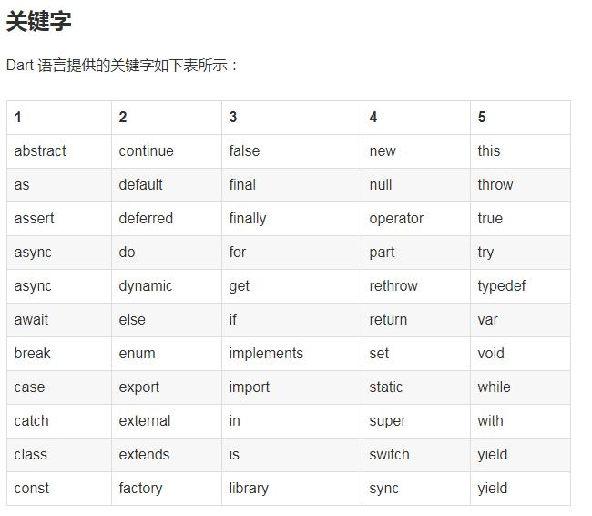

#Dart简介

目标: 成为下一代结构化Web开发语言。

风格: 类似JavaScript，Dart也是一种面向对象语言，但是它采用基于类编程。
   它只允许单一继承，语法风格接近C语言

历史：由Google主导开发，于2011年10月公开


# HelloWorld
```

// This is where the app starts executing.  启动函数( 类似于C语言 )
main() {
var name = 'Bob';
  printNumber("Hello World! $name");
}

```

# 注释
```
//   单行注释

/*  多行注释...*/
```


# 多行字符串
``` 
 多行字符串  开头结尾 `` `
var 定义了一个变量，但是没有指定特定的数据类型


 
```
# 一些重要的概念

```

所有的东西都是对象，无论是变量，数字，函数等。
所以的对象都是类的实例。
所有的对应都继承自内置的Object类。

程序中指定数据类型是为了指出自己的使用意图，并帮助语言进行语法检查。但是，指定类型不是必须的。
Dart 语言是弱数据类型。

Dart 代码在运行前解析。
指定数据类型和编译时的常量，可以提高运行速度。

Dart 程序有统一的程序入口: main()。
这一点是C / C++语言相像。

Dart 支持顶级的变量定义。

Dart 没有public ，protected，and private的概念。
但是如果变量或函数以下划线(_)开始，则该函数或变量属于这个包私有(private)的方法。

Dart 中变量或函数以下划线(_)或字母开始，后面接上任意组合的下划线(_)，数字或字母。
这点与大部分的编程语言是一样的。

严格区分expression 和 statement

Dart 的工具可以检查出警告信息(warning)和错误(errors)。
警告信息只是表明代码可能不工作，但是不会妨碍程序运行。
错误可以是编译时的错误，也可能是运行时的错误。编译的错误将阻止程序运行，运行时的错误将会以exception的方式呈现。

Dart 使用 ; 来分割语句
这点类似Java / C++, 但是与Python语言不同。

没有初始化的变量都会被赋予默认值 null.
即使是数字也是如此， 因为在Dart 中数字也是一个对象。


如果定义的变量不会变化，可以使用final 或 const来指明。
也可以使用final 或 const来代替类型声明。

final的值只能被设定一次。
const 是一个编译时的常量。( Const variables are implicitly final.)


```

# 关键字



#集合
```
List-------------------------------------
在 Dart　语言中，具有一系列相同类型的数据被称为 List 对象。
Dart List 对象类似JavaScript 语言的 array 对象。
var list = [1, 2, 3];
assert(list.length == 3);
assert(list[1] == 2);

list[1] = 1;
assert(list[1] == 1);


Map------------------------------------
Map　类型将keys 和 values 关联在一起。
keys 和 values 可以是任意类型的对象。
像其它支持Map 的编程语言一样，Map 的 key 必须是唯一的。

var gifts = {
// Keys      Values
  'first' : 'partridge',
  'second': 'turtledoves',
  'fifth' : 'golden rings'
};

var nobleGases = {
// Keys  Values
  2 :   'helium',
  10:   'neon',
  18:   'argon',
};

var gifts = new Map();
gifts['first'] = 'partridge';
gifts['second'] = 'turtledoves';
gifts['fifth'] = 'golden rings';

var nobleGases = new Map();
nobleGases[2] = 'helium';
nobleGases[10] = 'neon';
nobleGases[18] = 'argon';
使用.lenght 来获取key-value 对的数量：
assert(gifts.length == 2);

```

# 函数 
如果函数只有单个语句，可以采用简略的形式：
```
bool isNoble(int atomicNumber) => _nobleGases[atomicNumber] != null;


```

```
函数可以有两中类型的参数：

1. 必须的   必须的参数放在参数列表的前面。
1. 可选的   可选的参数跟在必须的参数后面。
```


**可选的名字参数**
在调用函数时，可以指定参数的名字及相应的取值

```
enableFlags({bool bold, bool hidden}) {
}

enableFlags(bold: true, hidden: false);  //【带参数说明】

```


**可选的参数**
```
将参数使用[] 括起来，用来表明是可选位置参数。

String say(String from, String msg, [String device]) {
  var result = '$from says $msg';
  if (device != null) {
    result = '$result with a $device';
  }
  return result;
}


say(from：'Bob', msg:'Howdy')   device 不是必须需要的参数
```


**参数默认值(可选参数)**
```

String say(String from, String msg,
    [String device = 'carrier pigeon' 【定义时 使用 =赋值可选参数的默认值】, String mood]) {
  var result = '$from says $msg';
  if (device != null) {
    result = '$result with a $device';
  }
  if (mood != null) {
    result = '$result (in a $mood mood)';
  }
  return result;
}

```


**main() 函数**
```
所以的APP 都必须有一个mian()函数，作为APP 的应用接入点。
main()函数返回void 类型

void main() {
......
}

```

**传递函数给函数**
```
可以将一个函数作为一个参数传递给另一个函数。例如：

var list = [1, 2, 3];

printElement(element) {
  print(element);
}

// Pass printElement as a parameter.
list.forEach(printElement);  【对列表的每一项执行函数 printElement】

--------------------
Function makeAdder(num addBy) {   【返回 Function 函数】
  return (num i) => addBy + i;
}

main() {
  // Create a function that adds 2.
  var add2 = makeAdder(2);

  // Create a function that adds 4.
  var add4 = makeAdder(4);

  assert(add2(3) == 5);
  assert(add4(3) == 7);
}

```


**函数返回值**
```
所以的函数都会有返回值。
如果没有指定函数返回值，则默认的返回值是null。
没有返回值的函数，系统会在最后添加隐式的return 语句。
```


**使用’mixins‘ 功能给类添加新的功能**

```
mixins 是一种方便重用一个类的代码的方法。
使用with 关键字来实现mixins的功能。

要实现一个mixin，创建一个扩展Object的类，没有声明构造函数，没有调用super. 例如:

abstract class Musical {
  bool canPlayPiano = false;
  bool canCompose = false;
  bool canConduct = false;

  void entertainMe() {
    if (canPlayPiano) {
      print('Playing piano');
    } else if (canConduct) {
      print('Waving hands');
    } else {
      print('Humming to self');
    }
  }
}


class Musician extends Performer with Musical {
  // ...
}

class Maestro extends Person
    with Musical, Aggressive, Demented {
  Maestro(String maestroName) {
    name = maestroName;
    canConduct = true;
  }
}


```