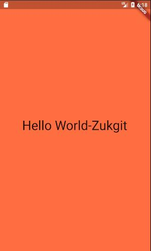
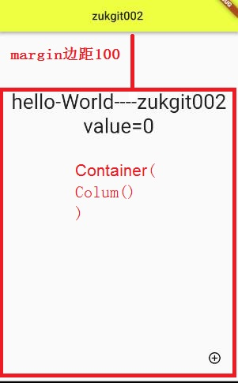
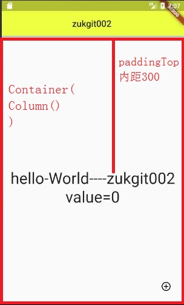
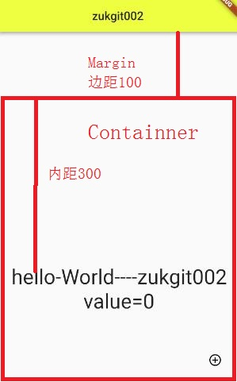
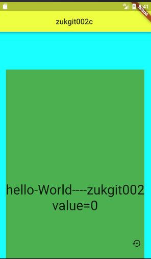
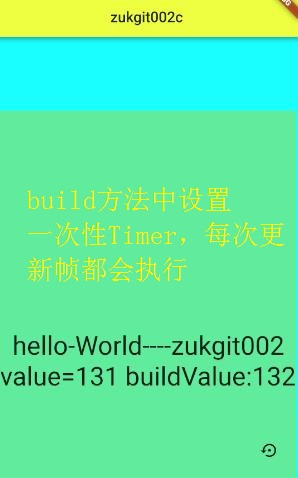
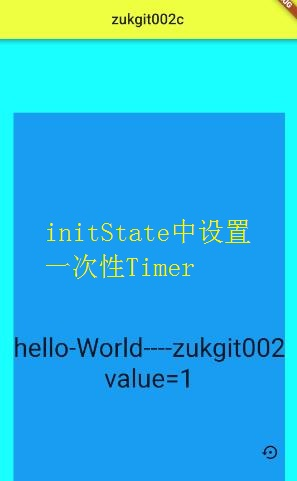
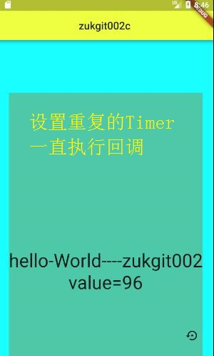

# 练习册

## test001： HelloWorld

日期: 2018年5月14日
```
练习目的： 
1. 熟悉MaterialApp应用运行基础
        void main(runApp(new MaterialApp(home: xxxx);)
        class  xxxx  extends StatefulWidget  { State<StatefulWidget> createState(){ return new xxxState()}}
        class  xxxxState extends  State<xxxx>  {     Widget build(BuildContext context){ return new Widget() }   }
2. 打印 HelloWorld
        new Text("hello-World----zukgit");
```

```
import 'package:flutter/material.dart';

void main() {
  runApp(new MaterialApp(home: new Zukgit()));
}

class Zukgit extends StatefulWidget {
  @override
  State<StatefulWidget> createState() {
    // TODO: implement createState
    return new ZukgitState();
  }
}

class ZukgitState extends State<Zukgit> {
  @override
  Widget build(BuildContext context) {
    // TODO: implement build
    return new Scaffold(
      backgroundColor: Colors.limeAccent,
        body: new Center(
            child: new Text(
      "hello-World----zukgit",
      style: new TextStyle(fontSize: 35.5),
    )));
  }
}

```

## test002： 主题设置
日期： 2018年5月14日


```
练习目的： 
1. 打印AppBar 菜单栏
2. 配置UI  熟悉Containner的 Margin 和 Padding
3. 配置 Scaffold的 floatingActionButton 按钮事件
4. 设置 Timer 定时器 来执行回调
5. 分别在方法 build(BuildContext context) 和 initState() 放置 一次性定时器 Timer 来分析生命周期， Build方法每次更新帧都会执行，initState只会执行一次
6. 设置重复定时器 Timer.periodic 来完成设置一次  定时重复执行的任务
```


```
import 'package:flutter/material.dart';
import 'dart:async';
import 'dart:math';

void main() {
  runApp(new MaterialApp(
      title: 'Zukgit_Test002',
      theme: new ThemeData(
          primaryColor: Colors.limeAccent, accentColor: Colors.deepOrange),
      home: new Zukgit()));
}

class Zukgit extends StatefulWidget {
  @override
  State<StatefulWidget> createState() {
    // TODO: implement createState
    return new ZukgitState();
  }
}

class ZukgitState extends State<Zukgit> {
  Timer _timeOnce;
  Timer _timeRepeat;
  Timer _time;
  var value = 0;
  var r = 0;
  var g = 0;
  var b = 0;
 var flag = true;


 @override
  void initState() {
    // TODO: implement initState
    super.initState();


    _time = Timer.periodic(new Duration(milliseconds: 1000), (Timer timer) { // 重复定时器
      setState(() {
        r = new Random().nextInt(255);
        g = new Random().nextInt(255);
        b = new Random().nextInt(255);
        value++;
      });
    });

//    _time = new Timer(new Duration(milliseconds: 1000), () {  // 一次定时器
//      setState(() {
//        r = new Random().nextInt(255);
//        g = new Random().nextInt(255);
//        b = new Random().nextInt(255);
//        value++;
//      });
//    });


  }
  @override
  Widget build(BuildContext context) {


    // TODO: implement build
    return new Scaffold(
      backgroundColor: Colors.cyanAccent,
      appBar: new AppBar(
          centerTitle: true,
          title: new Text(
            'zukgit002c',
            textAlign: TextAlign.center,
          )),
      body: new Center(
          child: new Container(
        color: new Color.fromARGB(100, r, g, b),
        margin: EdgeInsets.only(top: 100.0, left: 0.0, right: 0.0), // 边距
        padding: EdgeInsets.only(top: 300.0), // 内距
        child: new Column(
          children: <Widget>[
            new Text(
              "hello-World----zukgit002",
              style: new TextStyle(fontSize: 35.5),
            ),
            new Text(
              "value=$value",
              style: new TextStyle(fontSize: 35.5),
            ),
          ],
        ),
      )),
      floatingActionButton: new IconButton(
          icon: new Icon(Icons.settings_backup_restore),
          onPressed: () {
            setState(() {
              _time.cancel();
              value =0 ;
            });

          }),
    );
  }

  @override
  void dispose() {
    // TODO: implement dispose
    super.dispose();
    _time.cancel();
  }
}


```
