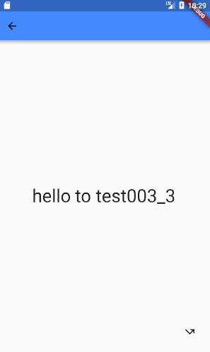

哦# 练习册

## test001： HelloWorld

日期: 2018年5月14日
```
练习目的： 
1. 熟悉MaterialApp应用运行基础
        void main(runApp(new MaterialApp(home: xxxx);)
        class  xxxx  extends StatefulWidget  { State<StatefulWidget> createState(){ return new xxxState()}}
        class  xxxxState extends  State<xxxx>  {     Widget build(BuildContext context){ return new Widget() }   }
2. 打印 HelloWorld
        new Text("hello-World----zukgit");
```

```
import 'package:flutter/material.dart';

void main() {
  runApp(new MaterialApp(home: new Zukgit()));
}

class Zukgit extends StatefulWidget {
  @override
  State<StatefulWidget> createState() {
    // TODO: implement createState
    return new ZukgitState();
  }
}

class ZukgitState extends State<Zukgit> {
  @override
  Widget build(BuildContext context) {
    // TODO: implement build
    return new Scaffold(
      backgroundColor: Colors.limeAccent,
        body: new Center(
            child: new Text(
      "hello-World----zukgit",
      style: new TextStyle(fontSize: 35.5),
    )));
  }
}

```

## test002： 主题设置
日期： 2018年5月14日


```
练习目的： 
1. 打印AppBar 菜单栏
2. 配置UI  熟悉Containner的 Margin 和 Padding
3. 配置 Scaffold的 floatingActionButton 按钮事件
4. 设置 Timer 定时器 来执行回调
5. 分别在方法 build(BuildContext context) 和 initState() 放置 一次性定时器 Timer 来分析生命周期， Build方法每次更新帧都会执行，initState只会执行一次
6. 设置重复定时器 Timer.periodic 来完成设置一次  定时重复执行的任务
```


```
import 'package:flutter/material.dart';
import 'dart:async';
import 'dart:math';

void main() {
  runApp(new MaterialApp(
      title: 'Zukgit_Test002',
      theme: new ThemeData(
          primaryColor: Colors.limeAccent, accentColor: Colors.deepOrange),
      home: new Zukgit()));
}

class Zukgit extends StatefulWidget {
  @override
  State<StatefulWidget> createState() {
    // TODO: implement createState
    return new ZukgitState();
  }
}

class ZukgitState extends State<Zukgit> {
  Timer _timeOnce;
  Timer _timeRepeat;
  Timer _time;
  var value = 0;
  var r = 0;
  var g = 0;
  var b = 0;
 var flag = true;


 @override
  void initState() {
    // TODO: implement initState
    super.initState();


    _time = Timer.periodic(new Duration(milliseconds: 1000), (Timer timer) { // 重复定时器
      setState(() {
        r = new Random().nextInt(255);
        g = new Random().nextInt(255);
        b = new Random().nextInt(255);
        value++;
      });
    });

//    _time = new Timer(new Duration(milliseconds: 1000), () {  // 一次定时器
//      setState(() {
//        r = new Random().nextInt(255);
//        g = new Random().nextInt(255);
//        b = new Random().nextInt(255);
//        value++;
//      });
//    });


  }
  @override
  Widget build(BuildContext context) {


    // TODO: implement build
    return new Scaffold(
      backgroundColor: Colors.cyanAccent,
      appBar: new AppBar(
          centerTitle: true,
          title: new Text(
            'zukgit002c',
            textAlign: TextAlign.center,
          )),
      body: new Center(
          child: new Container(
        color: new Color.fromARGB(100, r, g, b),
        margin: EdgeInsets.only(top: 100.0, left: 0.0, right: 0.0), // 边距
        padding: EdgeInsets.only(top: 300.0), // 内距
        child: new Column(
          children: <Widget>[
            new Text(
              "hello-World----zukgit002",
              style: new TextStyle(fontSize: 35.5),
            ),
            new Text(
              "value=$value",
              style: new TextStyle(fontSize: 35.5),
            ),
          ],
        ),
      )),
      floatingActionButton: new IconButton(
          icon: new Icon(Icons.settings_backup_restore),
          onPressed: () {
            setState(() {
              _time.cancel();
              value =0 ;
            });

          }),
    );
  }

  @override
  void dispose() {
    // TODO: implement dispose
    super.dispose();
    _time.cancel();
  }
}


```


## test003： 使用 SharedPreferences 来存储数据
日期： 2018年5月14日




```
练习目的： 
1. 设置SharedPreferences 来保存读取 数据
      pubspec.yaml 中加入依赖   shared_preferences: ^0.3.1
     import 'package:shared_preferences/shared_preferences.dart';
     
        SharedPreferences prefs; 
       _initSP() async { //【在异步方法中初始化 SharedPreferences 变量 】
            prefs = await SharedPreferences.getInstance();
            prefs.setString('userId', "zukgit");   【设置数据Key以及Value】
            String userId = (prefs.getString('userId') ?? "");  【获取对应Key的数据】
     }
2. 尝试使用 RaisedButton这个控件 Widget
                new RaisedButton(onPressed: _showSP, child: new Text('SP_Value = $_spValue'))

3.Navigation的使用 => 的作用 相当于  {return }；   这四个字符的作用

   
```


```

  _navigationNext() {
    Navigator.of(context).push(new MaterialPageRoute(builder: (BuildContext) => new Zukgit1()
    ));
  }
  

  void _navigationNext() {
    Navigator.pushAndRemoveUntil(
      context,
      new MaterialPageRoute(
          builder: (BuildContext context) => new Scaffold(
                body: new Center(
                  child: new Text(
                    "finish Page Stack!",
                    style: new TextStyle(color: Colors.redAccent,fontSize: 35.0),
                  ),
                ),
              )),
      ModalRoute.withName('/'),   【当前路由页面 back时 回到起始页面】
    );
  }
  


```


# 视图集合 Widget Set
```
MaterialApp-----------------------------MaterialApp(title: '', theme: ThemeData , home: Widget)
Padding---------------------------------Padding(padding: EdgeInsets, child: Widget)
Material--------------------------------Material(color: Colors.red,  child: Widget , type: MaterialType.circle)
Column----------------------------------Column(children: <Widget>[ ] , crossAxisAlignment: CrossAxisAlignment.end);
Row-------------------------------------Row(children: <Widget>[ ] , crossAxisAlignment: CrossAxisAlignment.start || mainAxisAlignment: MainAxisAlignment.spaceAround  MainAxisAlignment.center);
Text------------------------------------Text(title: '',textAlign: TextAlign.left , style: TextStyle(color: , ontSize: 20.0, fontWeight:FontWeight.bold ))
MaterialPageRoute-----------------------MaterialPageRoute(builder :  (BuildContext context){return widget} )
Scaffold--------------------------------Scaffold(appBar: new AppBar(title:Text) , body:new Center(child: widget) , bottomNavigationBar: Material【widget】,backgroundColor: Colors.red)
AppBar----------------------------------AppBar(title:Text ,centerTitle: true )
Center----------------------------------Center(child: widget))
TabBarView------------------------------TabBarView(children: <Widget>[ ] ， controller： TabController);
TabController---------------------------TabController( length: int , listener:(){xxx} , vsync: this)
IconTab---------------------------------IconTab( icon:  , color:  , text:'')
ListView.builder------------------------ListView.builder(itemCount: int ,itemBuilder ： (BuildContext context, int index) => widget )
InkWell---------------------------------InkWell(onTap:(){xxx}, child: widget)
SizedBox--------------------------------SizedBox( width: float, height: float, child: Card( child: widget))
Expanded--------------------------------Expanded(child: widget)
Container-------------------------------Container(child: widget , margin:EdgeInsets)
Divider---------------------------------Divider( height: float,  color : Colors.red )
Image.network---------------------------Image.network(url:'' , width: float,height: float ,  fit: BoxFit.cover)
RichText--------------------------------RichText(text: new TextSpan( text: '' , style:  TextStyle(color: , ontSize: 20.0, fontWeight:FontWeight.bold ) ))
Stack-----------------------------------Stack( children: <Widget>[] )
SingleChildScrollView-------------------SingleChildScrollView(child: widget)
SizedBox.fromSize-----------------------SizedBox.fromSize( size: Size.fromHeight( height: int) , child: widget )
Positioned------------------------------Positioned(top: float, left: float , child : widget)
BackButton------------------------------BackButton(color: color.white)
IconTheme-------------------------------IconTheme( data: IconThemeData(color: Colors.black) , child: widget );
PageView.builder------------------------PageView.builder( physics: AlwaysScrollableScrollPhysics, controller:PageController , itemBuilder:  (BuildContext context, int index) => widget  )
Image-----------------------------------Image( image: AssetImage(url； 'assets/images/ic_main_tab_my_pre.png' ) , height : float , width : float )
GestureDetector-------------------------GestureDetector(onTap: () {xxx},  child: widget );
showDialog------------------------------showDialog(context: context, child: new AlertDialog(content: Text))
AlertDialog-----------------------------AlertDialog(content: Text)
CircleAvatar----------------------------CircleAvatar( radius: 35.0, backgroundImage:new NetworkImage('url.jpg')
RaisedButton----------------------------RaisedButton(color: , onPress:(){xxx})

CustomScrollView---------------------------------CustomScrollView(slivers: <Widget>[ new SliverAppBar( expandedHeight: float, flexibleSpace：FlexibleSpaceBar) , 
new SliverList( delegate: SliverChildListDelegate(<Widget>[ ]) ] )
TabBar----------------------------------TabBar(controller: TabController , tabs: <IconTab>[ IconTab( icon:  , color:  , text:'') ]  ,
labelStyle : TextStyle , labelColor:  Colors.red ,indicatorSize: TabBarIndicatorSize.tab , indicatorColor: Theme.of(context).primaryColor)

```
